<div style="text-align: center;">
    <h1>PREDICTING 1-DAY STOCK PRICE MOVEMENT USING MACHINE LEARNING MODELS</h1>
    
</div>
<p style="text-align: center;">
    <strong>BY CHARLES LUSWATA,</strong><br>
    <strong>MS, BSTAT</strong>
</p>


<p style="text-align: center;">
<strong>Presented to the Faculty of The University of California, Berkeley Haas, in Partial Fulfillment of the Requirements for the </strong>
<strong>Professional Certificate in Machine Learning and Artificial Intelligence</strong><br>


    
</p>

<p style="text-align: center;">
Copyright<br>
    by<br>
Charles Luswata<br>
2024

</p>

**Introduction**<br>
Accurately predicting stock price movements is a challenging yet essential task for investors, financial analysts, and policymakers. Effective short-term predictions can greatly enhance investment strategies and risk management. This capstone project aimed to develop and evaluate machine learning models to predict whether a stock’s price will rise (Bullish) or fall (Bearish) the next trading day based on historical data and relevant features.<br>

**Problem Statement**<br>
Stock price movements are influenced by various factors including historical prices, trading volumes, market sentiment, company fundamentals, and external economic indicators. Traditional financial models often struggle with the non-linearity and volatility inherent in stock prices. This project sought to harness modern machine learning techniques to forecast whether a stock’s price would increase or decrease the following day, providing valuable insights for short-term trading and investment decisions.<br>

The project involved a comparative analysis of classifiers: K-Nearest Neighbor (KNN), Logistic Regression (LR), Gradient Boosting (GB) and Random Forest Decision Trees (RF) to classify the next day’s stock price as Bullish or Bearish.<br>

* **K-Nearest Neighbor (KNN)** is a non-parametric algorithm that classifies data based on the similarity of feature vectors, with classification determined by the majority class among the k-nearest neighbors. It is particularly useful for tasks where decision boundaries are irregular or complex (Cover and Hart, 1967; Han et al., 2011).<br>

* **Random Forest (RF)** is an ensemble technique that builds multiple decision trees during training and outputs the mode of the classes (for classification tasks) or mean prediction (for regression tasks) from individual trees. It is known for its robustness, ability to handle large datasets, and resistance to overfitting (Breiman, 2001).<br>

* **Logistic Regression (LR)** is a widely-used statistical method for binary classification. It applies the logistic function to estimate probabilities, which are then used to classify observations into one of two classes. Logistic Regression is favored for its simplicity, interpretability, and efficiency, particularly in scenarios where the relationship between the dependent and independent variables can be approximated by a linear boundary (Hosmer et al., 2013). <br>

* **Gradient Boosting Classifier (GB)** build models sequentially, with each model correcting the errors of its predecessors. GBs combine predictions from multiple weak learners, typically decision trees, to form a strong overall model. They are praised for their predictive accuracy and ability to manage various types of data (Friedman, 2001; Chen and Guestrin, 2016). GBs require careful hyperparameter tuning to avoid overfitting.<br>

**Objectives**<br>
- Compare KNN, LR, GB and RF models based on accuracy, training time, and ROC-AUC score to identify the most effective model for predicting the next day’s stock price action.<br>
- Analyze the interpretability of results from the selected model to understand the factors influencing stock price movements.<br>
- Explore complex interaction patterns among key features using the selected model.<br>

**Methodology**<br>

**Data Sources:** Historical stock price data was sourced from http://www.barchart.com.<br>
**Feature and Target Variables:** The dataset was split into features (X) and target labels (y), and then into training and test sets using Python’s train_test_split function.<br>

**Variable Description:**<br>
  ```
symbol     (Symbol)
extractdte     (Extract date)
px_open     (Open price)
px_low     (low price)
px_high     (high price)
domth     (Day of month)
doyr     (Day of year)
pchg_sup_min0     (% price above support  for the day)
pchg_floor_min0     (% price above support for current month)
ma_sup_pchg20     (% price above 20-Day average of support)
days_since_sup_lt1     (Days since price was  less than or equal to 1% above support)
pchg_ceil_max0     (% price below resistance for current month)
pchg_res_max0     (% price below resistance for the day)
pchg_res_max1     (% price below max resistance for previous 1 month)
days_since_res_lt1     (Days since price was  less than or equal to 1% below resistance)
pt_a_sup1     (Points above min support for previous 1 month)
pchg_sup_min1     (% price above min support for previous 1 month)
ma_res_pchg20     (% price below 20-Day average of resistance)
Res_sup_ratio     (Resistance/Support ratio)
pt_below_ceil     (Points below resistance)
pchg_px_max0     (% price below maximum price for current month)
pchg_px_min0     (% price above minimum price for current month)
pchg_px_avg0     (% price above average price for current month)
pcnt_high_open     (% high above open for the day)
pt_open_close     (Points gained/dropped from open to close for the day)
pt_last_prevhigh     (Points last above/below previous day's high)
pt_last_prevclose     (Points last above/below previous day's close)
pt_open_prevopen5     (Points open above/below previous 5th day's open)
Chg10D     (Points close above/below previous 10th day's close price)
pcnt_high_low     (% high above low for the day)
pcnt_open_low     (% open above low for the day)
Pcnt_last_below_1high     (% close below 1 month's high)
pcnt_open_prevclose     (% open above/below previous day's close)
close_open_ratio     (Close/Open prices ratio)
days_since_hvolbuy     (Days since maximum of 1 month's volume associated with green days)
days_since_hvolsell     (Days since maximum of 1 month's volume associated with red days)
days_since_mvavg_smashed     (Days since moving average lines are all smashed togeher)
atr_9d_n  (9-Days Average True Range)
rsi_9d_n     (9-Days Relative Strength Indicator)
rsi_9d_pchg1     (1-Day % change in 9-Days Relative Strength Indicator)
vix     (Volatility Index value)
vix_pchg1     (1-Day % change in Volatility Index value)
vix_pchg2     (2-Days % change in Volatility Index value)
vix_pchg5     (5-Days % change in Volatility Index value)
SPY_chg5d     (5-Days Points Change in the S&P500 ETF value)
SPY_ds_bull_advance     (Days since the S&P500 ETF entered an advance stage)
SPY_rsi_9d     (9-Days Relative Strength Indicator for the S&P500 ETF)
SPY_rsi_9d_p1     (1-Day % change in 9-Days RSI for the S&P500 ETF)
SPY_rsi_9d_p2     (2-Days % change in 9-Days RSI for the S&P500 ETF)
SPY_5dmvavg_pchg1     (1-Day % change in 5-day moving average for the S&P500 ETF)
SPY_ds_bull_jump     (Day since the S&P500 ETF jumped over a moving average line)
SPY_ds_bull_Xv     (Day since 2 S&P500 ETF moving average lins crossed)
SPY_p_resist     (% S&P500 ETF below resistance for the day)
SPY_p_support     (% S&P500 ETF above support  for the day)
SPY_dcr     (Daily closing range for the S&P500 ETF)
SPY_p_50dmvavg     (% S&P500 ETF above 50-day moving average)
SPY_5dmvavg_pchg2     (2-Days % change in 5-day moving average for the S&P500 ETF)
SPY_ds_bbl     (Days since the S&P500 ETF below lower Bollinger Band)
SPY_ds_bull_3L2H     (Days since 3 lows and 2 highs pattern in the S&P500 ETF)
SPY_pcnt_hvol_buysell     (Days since highest buying volume in the S&P500 ETF)
SPY_bbwidth     (Bollinger Bands width for the S&P500 ETF )
days_to_fomc     (Days to FOMC meeting)
days_to_jobs     (Days to jobs report)
days_to_cpi     (Days to CPI report)
days_to_pce     (Days to PCE report)
pcnt_chg_n     (Day % change in price)
GR     (Green-Red pattern)
Pcnt_stoch3     (3-Day % Stochastic)
mth     (Month)
dcr_pchg2     (2-Days % change in Daily Closing Range)
mvavg_10d_pchg2     (2-Days % change in 10-days moving average)
Fib_382pcnt_n     ( Fibonacci 38.2%)
macd_9d_n     (9-Days MACD)
MFM     (Accumulation/Distribution Indicator)
mvavg_5d_pchg5     (5-Days % change in 5-days moving average)
mvavg_10d_pchg1     (1-Day % change in 10-days moving average)
Pcnt_Above_mvavg_5d     (% above 5-days moving average)
Pcnt_Above_mvavg_10d     (% above 10-days moving average)
Pcnt_5d_mvavg_10d     (% 5-days moving average above 10-days moving average)
signal_len_ratio     (Ratio of number of bullish to bearish patterns)

Target Variable:
anal00_daytrade (Next day class of price action: 1 - Bullish; 0 - Bearish) 
  ```
**Inclusion Criteria:** The analysis targeted stocks from companies with a market capitalization of at least 1 billion dollars. Additional requirements were:<br>
- Excluded data from 10 days before to 30 days after a stock split.<br>
- The stock must have traded at or above $25 at least once in the past 2 years.<br>
- A minimum 40% increase in trading volume over the last 30 days.<br>

**Data Preprocessing:** Included cleaning, handling duplicates and missing data, visualization, and feature engineering including one-hot encoding of categorical features.<br>

**Model Training and Evaluation** <br>
**Hyperparameter Tuning:** Explored the following parameter grids:<br>
  * **KNN:** n_neighbors values of 3, 5, 7, 10, 20, 30.<br>
  * **Logistic Regression:** C values of 0.001, 0.01, 0.1, 1, 10, 100; Penalty: l1, l2, none and Solver: liblinear.<br>
  * **Random Forest:** n_estimators values of 5, 7, 10, 50, 100; criterion: gini and entropy; random_state values of 20, 30; max_depth values of None,2, 3, 4, 5, 6, 10; min_samples_split values of 2, 5; min_samples_leaf values of 2,4,5; and bootstrap; True, False.<br>
  * **Gradient Boosting:** n_estimators values of 5, 7, 10, 50, 100; learning rate values of 0.001, 0.01, 0.1, 0.2; max_depth values of 3, 4, 5, 6, 10; min_samples_split values of 2, 5; min_samples_leaf values of 1, 2, 4.<br>

Used GridSearchCV with 5-fold cross-validation to optimize hyperparameters and measured training duration with Python’s time.time() function.<br>

**Predictions and Performance Metrics:** <br>
* **Prediction Scores:** Computed for training and test sets.<br>
* **Accuracy Scores:** Evaluated for training and test datasets.<br>
* **Classification Report:** Detailed precision, recall, and F1-score for test sets.<br>
* **Confusion Matrix:** Visualized model performance.<br>
* **ROC-AUC Score:** Assessed performance on imbalanced classes.<br>

The final model was optimized with the best parameters to predict the stock price movement for the following day.<br>

**Results:** Model Comparison
 ```
Model: KNN
Train Accuracy: 0.8635
Test Accuracy: 0.7297
ROC-AUC Score: 0.7874
Fit Time: 7.4480 seconds
Best CV score: 0.7327
Best Parameters: {'n_neighbors': 3}
Classification Report (Test):
              precision    recall  f1-score   support

         0.0       0.75      0.76      0.75      6827
         1.0       0.71      0.70      0.70      5724

    accuracy                           0.73     12551
   macro avg       0.73      0.73      0.73     12551
weighted avg       0.73      0.73      0.73     12551

Confusion Matrix (Test):
[[5169 1658]
 [1735 3989]]


Model: Logistic Regression
Train Accuracy: 0.7720
Test Accuracy: 0.7681
ROC-AUC Score: 0.8408
Fit Time: 13.5572 seconds
Best CV score: 0.7708
Best Parameters: {'C': 0.01, 'penalty': 'l1', 'solver': 'liblinear'}
Classification Report (Test):
              precision    recall  f1-score   support

         0.0       0.78      0.80      0.79      6827
         1.0       0.75      0.73      0.74      5724

    accuracy                           0.77     12551
   macro avg       0.77      0.77      0.77     12551
weighted avg       0.77      0.77      0.77     12551

Confusion Matrix (Test):
[[5446 1381]
 [1530 4194]]


Model: Random Forest
Train Accuracy: 1.0000
Test Accuracy: 0.8775
ROC-AUC Score: 0.9466
Fit Time: 4162.7868 seconds
Best CV score: 0.8732
Best Parameters: {'bootstrap': False, 'criterion': 'entropy', 'max_depth': None, 'min_samples_leaf': 2, 'min_samples_split': 2, 'n_estimators': 100, 'random_state': 20}
Classification Report (Test):
              precision    recall  f1-score   support

         0.0       0.88      0.90      0.89      6827
         1.0       0.87      0.86      0.86      5724

    accuracy                           0.88     12551
   macro avg       0.88      0.88      0.88     12551
weighted avg       0.88      0.88      0.88     12551

Confusion Matrix (Test):
[[6113  714]
 [ 824 4900]]


Model: Gradient Boosting
Train Accuracy: 1.0000
Test Accuracy: 0.8837
ROC-AUC Score: 0.9509
Fit Time: 10016.6132 seconds
Best CV score: 0.8830
Best Parameters: {'learning_rate': 0.2, 'max_depth': 10, 'min_samples_leaf': 4, 'min_samples_split': 5, 'n_estimators': 100}
Classification Report (Test):
              precision    recall  f1-score   support

         0.0       0.89      0.90      0.89      6827
         1.0       0.88      0.87      0.87      5724

    accuracy                           0.88     12551
   macro avg       0.88      0.88      0.88     12551
weighted avg       0.88      0.88      0.88     12551

Confusion Matrix (Test):
[[6126  701]
 [ 759 4965]]


Summary of Results:
                 Model  Train Time  Train Accuracy  Test Accuracy  ROC_AUC
0                  KNN        7.45            0.86           0.73     0.79
1  Logistic Regression       13.56            0.77           0.77     0.84
2        Random Forest     4162.79            1.00           0.88     0.95
3    Gradient Boosting    10016.61            1.00           0.88     0.95
 ```

**Interpretation:**<br>
- Random Forest (RF) and Gradient Boosting (GB) had the highest test accuracy and ROC-AUC scores, indicating strong performance and the ability to distinguish between classes (Bulls vs Bears) effectively.<br>
- KNN showed a significant drop from training to test accuracy, suggesting overfitting.<br>
- Logistic Regression performed well with reasonable accuracy and ROC-AUC scores but did not achieve the high performance of the ensemble methods.<br>

Overall, Random Forest and Gradient Boosting were the top-performing models in terms of test accuracy and ROC-AUC scores, while Logistic Regression and KNN had lower performance metrics and were less effective at distinguishing between the classes. Gradient Boosting required the most computing resources.<br>

Random Forest was selected for its outstanding performance, achieving a test accuracy of 88% and a top ROC-AUC score of 95%. It also had the advantage of requiring less than half the training time compared to Gradient Boosting. These metrics highlight its strong generalization to unseen data and its effectiveness in distinguishing between classes. The algorithm excels in capturing intricate relationships and interactions between features. Furthermore, it provides valuable insights into feature importance, making it a robust choice for practical machine learning applications, particularly when computational resources are available.<br>


**FITTING THE SELECTED MODEL: RANDOM FOREST**<br>

A random forest is essentially an ensemble of decision trees, each with slight variations. The concept behind random forests is that while individual trees might perform well in predicting outcomes, they are prone to overfitting the training data. By combining the predictions from multiple trees (100 in our case), the model mitigates overfitting through averaging, thereby enhancing overall performance (Müller and Guido, 2017).<br>

Random Forest’s ability to handle complex, non-linear relationships, its robustness to overfitting and noise, and its provision of feature importance make it a powerful tool for stock market prediction. Its ensemble learning approach ensures stability and accuracy, which are crucial for making reliable predictions in the unpredictable and often volatile financial markets.<br>

**Feature Importance**<br>
The random forest provided feature importances, which are computed by aggregating the feature importances over the trees in the forest. <br>

The most significant features identified by the Random Forest classifier include stock price support and resistance levels, price action metrics (such as minimum, maximum, and average prices over the past 30 days), the volatility index, moving averages, the number of days until key economic reports (CPI, PCE, Jobs, and FOMC), the behavior of the S&P 500, and trading volume.<br>

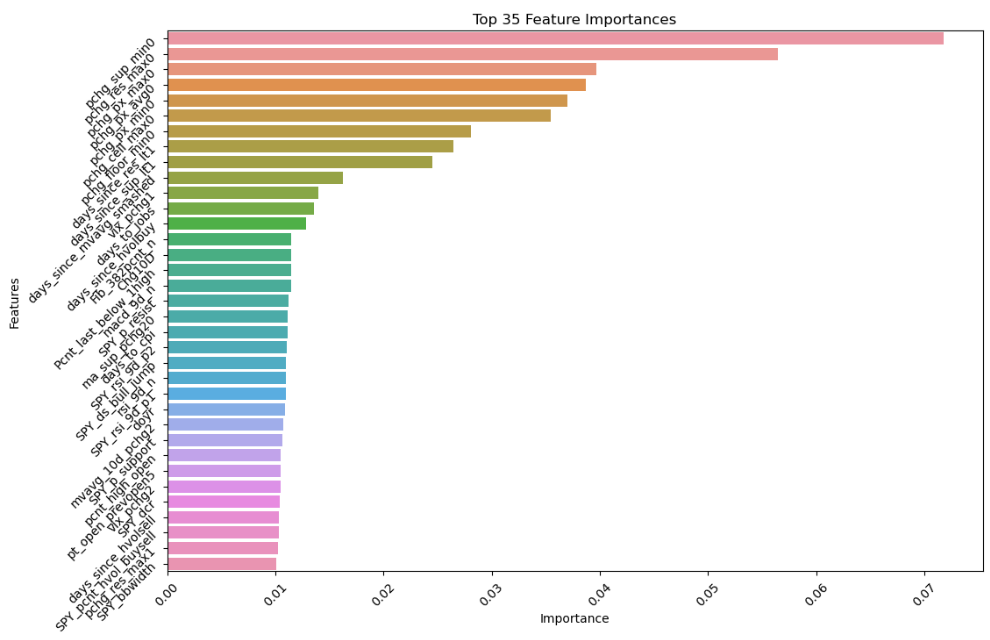

**Model Evaluation**
 ```
Classification Report (Training Set):
              precision    recall  f1-score   support

         0.0       1.00      1.00      1.00     20428
         1.0       1.00      1.00      1.00     17225

    accuracy                           1.00     37653
   macro avg       1.00      1.00      1.00     37653
weighted avg       1.00      1.00      1.00     37653


Classification Report (Test Set):
              precision    recall  f1-score   support

         0.0       0.88      0.90      0.89      6827
         1.0       0.87      0.86      0.86      5724

    accuracy                           0.88     12551
   macro avg       0.88      0.88      0.88     12551
weighted avg       0.88      0.88      0.88     12551
 ```

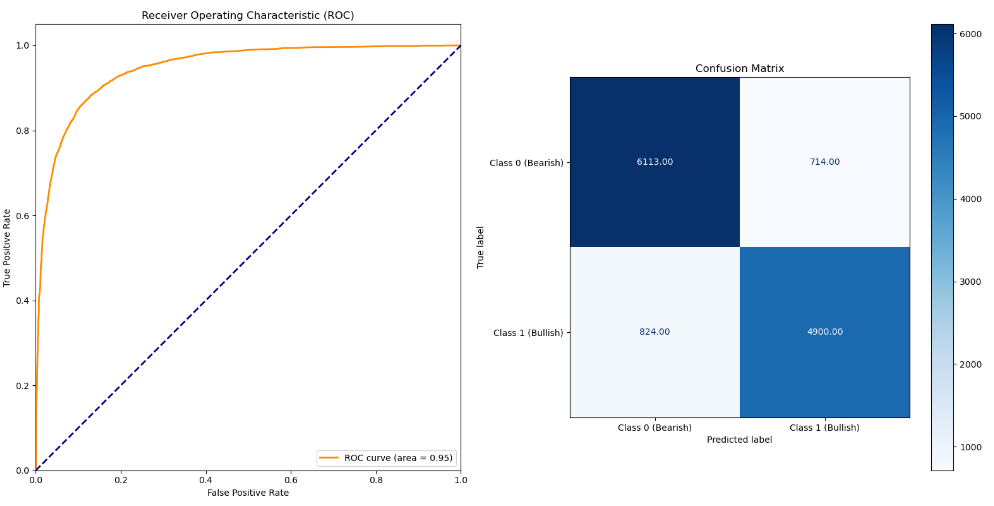


The classification report indicated that the model performed well overall, with high precision, recall, and F1-scores for both classes. The accuracy of 88%, ROC-AUC score of 95% and balanced averages across metrics suggest that the model is effective at distinguishing between the classes and handles class imbalance well, making it a robust model for the given task.<br>

**Visualizing a Sample of Individual Decision Trees (out of 100)**<br>

**Tree 1**<br>

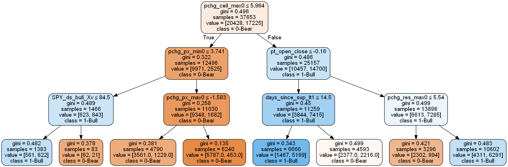

**Tree 2**<br>

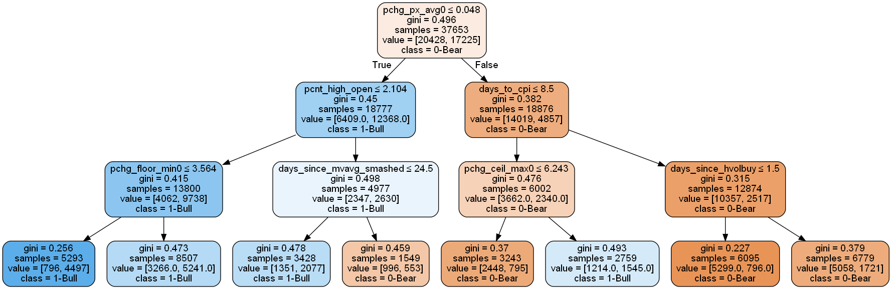

**Tree 12**<br>

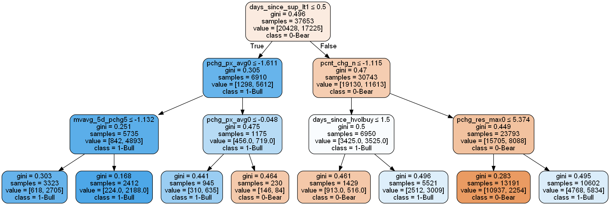


**Complex interaction patterns analysis**<br>

Decision Trees are adept at uncovering complex interaction patterns among features. These patterns can significantly enhance the performance of traditional linear and logistic regression models by revealing intricate relationships that linear models might overlook. This improvement in understanding can lead to increased predictive accuracy and robustness, ultimately enabling better generalization to new, unseen data.<br>

Here is an example of how to interpret complex interaction patterns from various decision trees within the random forest:<br>

**Tree 1**<br>
- `pchg_px_min0` interacts with `pchg_ceil_max0` to determine the class (1 - Bullish or 0 - Bearish) for the next day. The interaction is further influenced by `SPY_ds_bull_Xv`.
- `pchg_px_max0` interacts with `pchg_ceil_max0` to determine the class.
- `pt_open_close` directly affects `days_since_sup_lt1` to determine the class when `pchg_ceil_max0 > 5.96`.
- `pt_open_close` interacts with `pchg_res_max0` to determine the class outcome.

**Tree 2**<br>
- `pchg_px_avg0` and `pcnt_high_open`: When `pchg_px_avg0 ≤ 0.05`, `pcnt_high_open` does not influence the class outcome; the class is always 1.0 regardless of `pchg_floor_min0`.
- `pcnt_high_open` and `days_since_mvavg_smashed`: When `pchg_px_avg0 ≤ 0.05`, `days_since_mvavg_smashed` impacts the class outcome; the class is 1.0 if `days_since_mvavg_smashed ≤ 24.50`, otherwise 0.0.
- `pchg_px_avg0` and `days_to_cpi`: When `pchg_px_avg0 > 0.05`, `days_to_cpi` affects the class outcome based on `pchg_ceil_max0`; the class is 0.0 if `days_to_cpi ≤ 8.50` and `pchg_ceil_max0 ≤ 6.24`, otherwise 1.0 if `pchg_ceil_max0 > 6.24`.
- `days_to_cpi` and `days_since_hvolbuy`: When `pchg_px_avg0 > 0.05` and `days_to_cpi > 8.50`, `days_since_hvolbuy` determines the class outcome; the class is consistently 0.0 regardless of `days_since_hvolbuy`.

**Tree 12**<br>
- `days_since_sup_lt1` and `pcnt_chg_n`: When `days_since_sup_lt1` is greater than 0.50, the class outcome depends on `pcnt_chg_n` and `days_since_hvolbuy`.
- `pcnt_chg_n` and `pchg_res_max0`: When `days_since_sup_lt1` is greater than 0.50, if `pcnt_chg_n` is greater than -1.12, the class outcome depends on `pchg_res_max0`.


The interactions are complex because they involve the interplay of multiple features to determine the final class, rather than the outcome being determined by a single feature in isolation.


**Conclusion**<br>
In summary, our analysis found that the Random Forest classifier outperformed the traditional Logistic Regression model and other machine learning techniques. It proved to be more efficient, utilizing less than half the computational resources required by Gradient Boosting, and achieved an accuracy rate of 88% in predicting the next day’s stock price movement. The study successfully identified key features influencing price action, such as support and resistance levels, price metrics (minimum, maximum, average prices over the past 30 days), the volatility index, moving averages, the timing of key economic reports (CPI, PCE, Jobs, and FOMC), the behavior of the S&P 500, and trading volume.
According to the Efficient Market Hypothesis (EMH), financial markets are considered "informationally efficient," meaning asset prices reflect all available information—both public and private—at any given time. As our analysis is based on historical data, there is inherent risk involved, and financial losses can occur without proper research and risk management. Short-term investors and traders often seek to profit from market anomalies, misinterpreted information, and behavioral biases. Therefore, passively managed index funds are frequently recommended for those seeking to match market returns rather than exceed them.
Furthermore, continued research into complex feature interactions is crucial for advancing predictive modeling and machine learning. By exploring how different features interact, researchers and practitioners can develop models that are not only more accurate but also more interpretable and applicable to real-world scenarios.

**DISCLAIMER:** The results and conclusions drawn from this study are based on historical data and machine learning models. Past performance is not indicative of future results, and investing in financial markets carries risks. It is important to conduct thorough research and implement robust risk management strategies before making investment decisions.


**References**<br>
- Breiman, L. (2001). Random forests. Machine Learning, 45(1), 5-32.
- Chen, T., & Guestrin, C. (2016). XGBoost: A scalable tree boosting system. Proceedings of the 22nd ACM SIGKDD International Conference on Knowledge Discovery and Data Mining, 785-794.
- Cover, T., & Hart, P. (1967). Nearest neighbor pattern classification. IEEE Transactions on Information Theory, 13(1), 21-27.
- Friedman, J. H. (2001). Greedy function approximation: A gradient boosting machine. The Annals of Statistics, 29(5), 1189-1232.
- Goodfellow, I., Bengio, Y., & Courville, A. (2016). Deep Learning. MIT Press.
- Han, J., Kamber, M., & Pei, J. (2011). Data Mining: Concepts and Techniques. Morgan Kaufmann.
- Hochreiter, S., & Schmidhuber, J. (1997). Long short-term memory. Neural Computation, 9(8), 1735-1780.
- Müller, Andreas C., and Sarah Guido. Introduction to Machine Learning with Python: A Guide for Data Scientists. O'Reilly Media, 2017.<br>

 
**APPENDICES**<br>

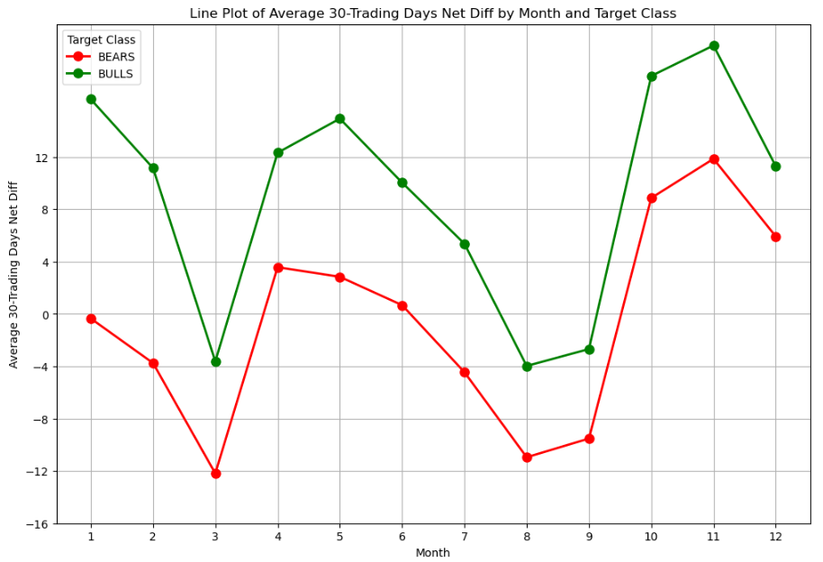


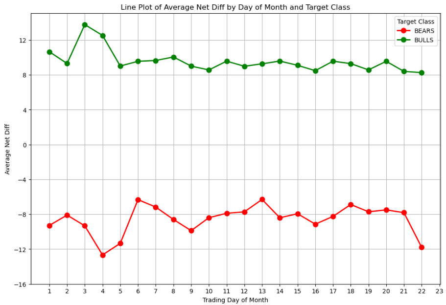

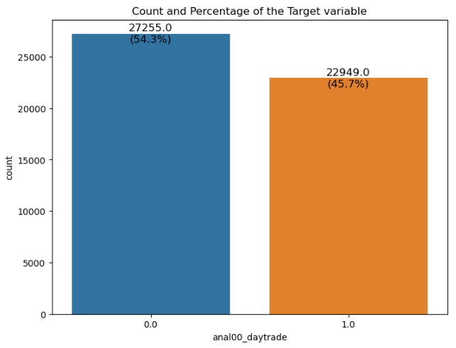

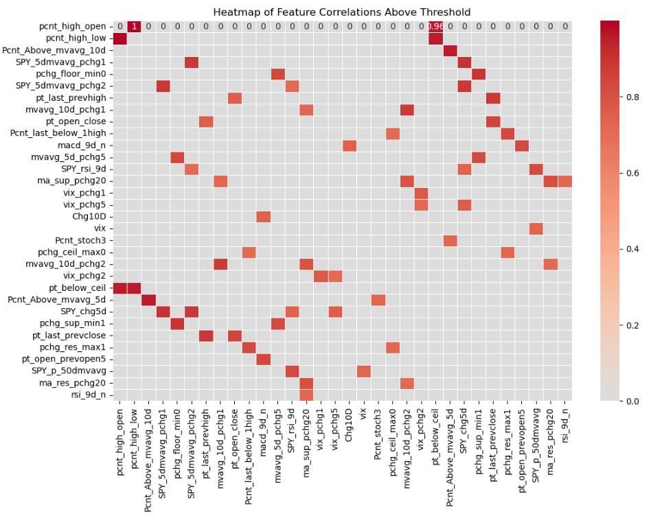


**Predictions based on Random Forest Classifier**<br>
Machine learning and AI are often described as a "black box" because many algorithms function in ways that make it hard to grasp how they reach their decisions or predictions.

The predicted Target class is for the following trading day.

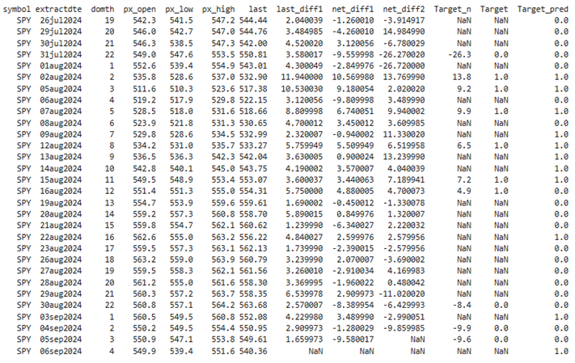

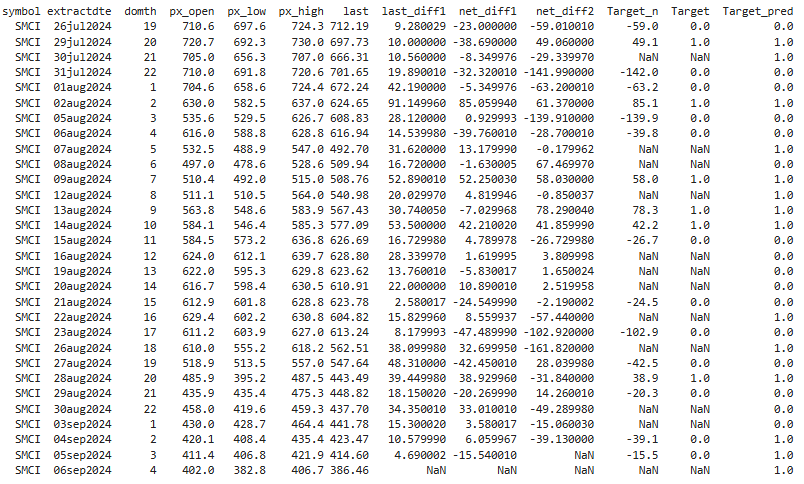

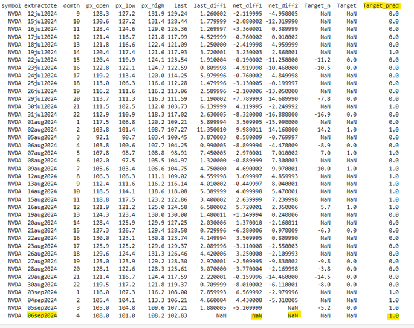


Contact and Further Information<br>

Charles Luswata<br>
Email: cluswata@gmail.com<br>
[LinkedIn](https://www.linkedin.com/in/charles-luswata-m-s-0838501b/)


